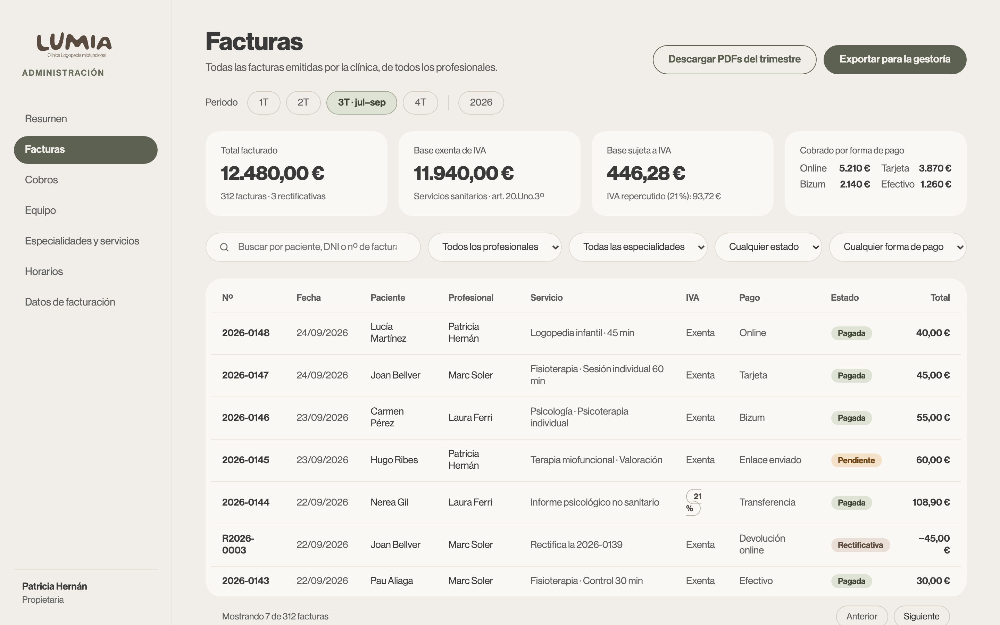
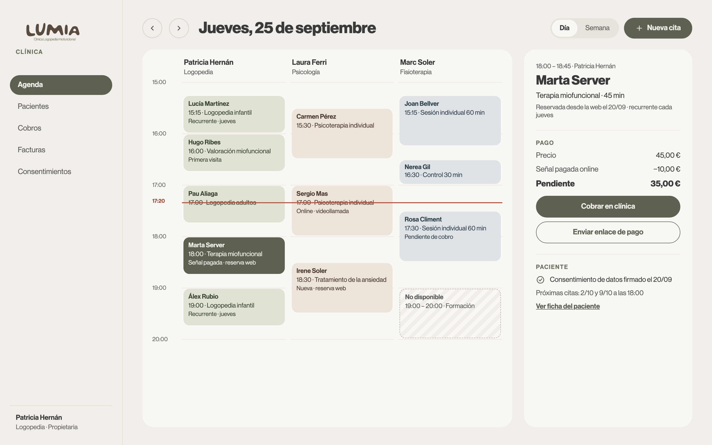
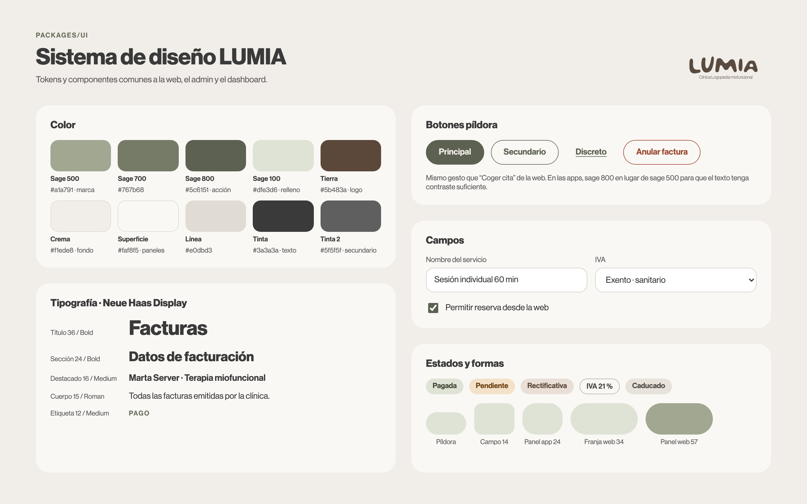

# Plataforma LUMIA v1 — Diseño

Fecha: 2026-09-25 · Estado: aprobado

## 1. Objetivo

Que LUMIA gestione su día a día sin Google Calendar ni emails sueltos:
los pacientes reservan, pagan y gestionan sus citas desde la web; el
equipo trabaja desde el **dashboard** (agenda, pacientes, cobros,
facturas, consentimientos); Patricia configura y controla la clínica
desde el **admin** (equipo, especialidades, servicios, horarios,
facturación y el resumen trimestral para la gestoría).

Éxito de la v1: una cita reservada en la web aparece al instante en la
agenda del profesional, el paciente puede cancelarla dentro del plazo y
recuperar la señal, la factura se emite a nombre de la clínica y, al
cerrar el trimestre, la gestoría recibe los totales y los PDF con un clic.

## 2. Decisiones tomadas

| Tema | Decisión |
|------|----------|
| Base de datos | Supabase, creado desde el Marketplace de Vercel en la cuenta `clinicalumia`, región UE. Dos proyectos: `lumia-db-dev` y el de producción. |
| Cambios de esquema | Solo migraciones SQL en `packages/db/supabase/migrations`. Se aplican primero a dev y después, a mano, a prod (`make db.push.prod`). Nunca cambios manuales en el panel de Supabase. |
| Roles del equipo | `owner` (Propietaria: admin + dashboard) y `employee` (Empleado: solo dashboard). |
| Emisor de facturas | Siempre la clínica (un NIF, una numeración). Cada profesional emite desde el dashboard en nombre de la clínica y figura en la factura con su especialidad y nº de colegiado. |
| IVA | Cada servicio define si está exento (sanitario, art. 20.Uno.3º LIVA) o sujeto al 21 %. Pendiente de validar con la gestoría. |
| Verifactu | Pendiente de decidir en la pieza de facturación (proveedor certificado, todo propio o aplazar el envío). La facturación se diseña desde el principio inalterable, correlativa y con rectificativas. |
| Pagos | Redsys por redirección (tarjeta y Bizum). El pago solo se da por bueno con la notificación firmada servidor a servidor. |
| Enlaces de cobro | Creados en el dashboard; se comparten copiando el enlace, con QR, por WhatsApp o por email. |
| Agenda | Propia, como única fuente de verdad. Cada empleado se suscribe a un calendario de solo lectura (ICS) para ver sus citas en el móvil. |
| Reserva web | El paciente busca por especialidad, elige servicio, profesional y hueco. Pago al reservar configurable por servicio: nada, señal fija, porcentaje o total. |
| Área de paciente | En la web, acceso por código de un solo uso enviado al email (sin contraseña). Ver, cancelar y cambiar citas; pagar; descargar facturas; ver consentimientos; gestionar a hijos menores. |
| Cancelación | Plazo de cancelación gratuita en horas, general y sobrescribible por servicio. Dentro de plazo, devolución automática de la señal por Redsys. Fuera de plazo o sin presentarse, la señal se queda en la clínica. Si cancela la clínica, siempre se devuelve. Se puede eximir de señal a pacientes con tratamiento continuado. |
| Diseño | `packages/ui` compartido por web, admin y dashboard: tokens de marca LUMIA y componentes basados en shadcn/ui restilados. Aprobado a partir de las pantallas de ejemplo. |
| Diseño visual | Aprobado con los bocetos de la sección 6: admin (facturas), dashboard (agenda del día) y hoja del sistema de diseño. |
| Forma de trabajar | Commits pequeños e incrementales, cada uno compilando y con sus tests; TDD; un worktree por tarea. |

## 3. Hoja de ruta

### v1 (seis piezas, cada una con su propio diseño detallado, plan y entregas)

1. **Base y configuración** (este documento, sección 4): migraciones sincronizadas, `packages/ui`, login e invitaciones que funcionen, arreglos de seguridad, admin de configuración y publicación de admin y dashboard.
2. **Pacientes**: ficha única (datos, tutor si es menor, historial), sin duplicados por DNI, email o teléfono.
3. **Agenda y reservas**: agenda del dashboard (día y semana, crear, mover y cancelar, citas recurrentes, "no se presentó"), reserva pública en la web, área de paciente, recordatorios por email y suscripción ICS por empleado.
4. **Pagos**: Redsys (señal al reservar, enlaces de cobro, devoluciones) y registro de cobros en clínica (efectivo, datáfono, Bizum).
5. **Facturación**: emisión en el dashboard, listado con filtros, resumen trimestral y exportación para la gestoría en el admin, rectificativas y Verifactu.
6. **Consentimientos**: el formulario actual pasa a guardarse en la ficha del paciente además de enviarse por email; listado en el dashboard.

Dependencias: 1 → 2 → 3 → 4 → 5. La 6 solo depende de la 2 y puede adelantarse.

### v1.1

Salas o cabinas en la agenda · sesiones online con enlace de videollamada · importar citas y pacientes de Google Calendar · registro de accesos a fichas.

### v2

Recordatorios por WhatsApp o SMS · bonos de sesiones · facturas a mutuas y empresas con retención.

### Preparado desde la v1 para no rehacer

La agenda reserva "recursos" (hoy, profesionales; mañana, también salas). Las citas tienen modalidad (presencial u online). Cobros y facturas tienen un "cliente" que puede ser el paciente o una empresa.

## 4. Pieza 1 — Base y configuración

### 4.1 Entornos y migraciones

- **Credenciales**: `packages/db/.env.dev` y `packages/db/.env.prod` (fuera de git) con la cadena de conexión y el `project-ref` de cada base de datos. Se añaden a `.gitignore` y se documentan en un `.env.example`.
- **Comandos del Makefile**:
  - `make db.migrate name=…` — crea una migración (ya existe).
  - `make db.status` — muestra, por migración, si está aplicada en dev y en prod.
  - `make db.push.dev` — aplica en dev las migraciones que falten.
  - `make db.push.prod` — pide confirmación y se niega si alguna migración no está aplicada antes en dev.
  - `make db.types` — genera `packages/db/types.ts` desde dev; el archivo se versiona y lo usan `packages/api` y las apps.
  - `make db.config.dev` / `make db.config.prod` — aplican la configuración de login (`supabase/config.toml` más una sección por entorno) para que tampoco se desalinee.
- **Desarrollo local**: Supabase local en Docker (OrbStack en el Mac; también sirve Docker Desktop) para desarrollar y ejecutar los tests sin tocar `lumia-db-dev`; `lumia-db-dev` es el entorno compartido de pruebas antes de producción.
- **Makefile como punto de entrada único** de todo el desarrollo: comprobar requisitos, instalar, arrancar y parar Docker y Supabase local, levantar las apps, tests, lint, tipos, migraciones por entorno y despliegues. `make help` los lista todos.

### 4.2 Esquema (migraciones de esta pieza)

1. **Roles**: renombrar el valor `doctor` a `employee`.
2. **Empleados** (`profiles`): añadir `license_number` (nº de colegiado, opcional). Función `is_active_staff()` (perfil activo, cualquier rol) junto a la `is_owner()` existente.
3. **Especialidades de partida**: Logopedia, Psicología y Fisioterapia (inserción idempotente).
4. **Servicios** (`services`): especialidad, nombre, duración en minutos, precio en céntimos, IVA (`exempt` o `standard_21`), si se reserva en la web, tipo de pago al reservar (`none`, `fixed`, `percent`, `full`) y su valor, plazo de cancelación propio (opcional) y activo.
5. **Horarios** (`employee_schedules`): tramos semanales por empleado (día de la semana, hora de inicio y de fin; varios tramos por día). **Ausencias** (`employee_time_off`): desde, hasta y motivo.
6. **Datos de la clínica** (`clinic_settings`, una sola fila): titular o razón social, NIF, domicilio, teléfono, email, web, logo, texto de exención de IVA, pie de factura, prefijos de serie (ordinaria y rectificativa), plazo de cancelación general en horas y zona horaria (`Europe/Madrid`).
7. **Almacenamiento**: bucket `branding` para el logo.
8. **Permisos**: lectura para personal activo (`is_active_staff()`), escritura solo para `owner`. Ningún permiso depende de "haber iniciado sesión" sin más. La lectura pública de servicios y especialidades para la reserva web se añade en la pieza 3.

### 4.3 Acceso y seguridad

- **Registro desactivado**: solo se entra por invitación.
- **Invitación**: el email lleva a `/auth/confirm` del dashboard, que valida el enlace y pide fijar la contraseña en `/auth/contrasena`. Mismo camino para "He olvidado mi contraseña" desde el login. Las URL de los emails usan la dirección de cada entorno.
- **Admin**: entra la propietaria con su misma cuenta. Cada acción del servidor que use la clave de servicio comprueba primero que quien la llama es `owner` (función común `requireOwner()`), no solo el layout.
- **Errores visibles**: las acciones del admin devuelven el error y la pantalla lo muestra; ninguna lo ignora.
- **Verificación en dos pasos** (TOTP con app de autenticación) obligatoria para todo el personal, en admin y dashboard. Se activa al final de la pieza, cuando el alta y el acceso ya funcionen.

### 4.4 Sistema de diseño (`packages/ui`)

- **Tokens** en un CSS de Tailwind v4 importado por las tres apps: la paleta LUMIA (sage 100–800, crema, superficie, línea, tinta, tierra, estados), los radios (píldora, campo 14, panel de app 24, franja web 34, panel web 57) y dos escalas de texto (la fluida de la web y una fija para las apps).
- **Tipografía**: los `woff2` de Neue Haas Display se mueven de `apps/web/app/fonts` al paquete, que exporta la fuente lista para `next/font`.
- **Componentes** (shadcn/ui restilado): botón píldora (principal, secundario, discreto, peligro), campo, selector, casilla, etiqueta, diálogo, tabla, etiqueta de estado, aviso y el armazón de las apps (menú lateral, cabecera, contenido), tal como en las pantallas aprobadas.
- **Contraste**: en las apps, texto y botones en sage 800 (`#5c6151`) o más oscuro; el sage de marca (`#a1a791`) solo en superficies grandes o texto de 24px o más.
- **Web**: pasa a leer los tokens y la fuente del paquete sin cambios visibles. Se verifica con las 33 medidas contra el boceto que ya pasan hoy.

### 4.5 Pantallas del admin

- **Equipo**: listado (incluida la propietaria), invitar (nombre, email, especialidad, nº de colegiado), editar, activar o desactivar y reenviar la invitación.
- **Especialidades**: crear, renombrar y eliminar. No se puede eliminar una especialidad con servicios; los empleados que la tengan quedan sin especialidad.
- **Servicios**: por especialidad, con todos los campos de 4.2.4.
- **Horarios**: horario semanal de cada empleado y sus ausencias.
- **Datos de facturación**: el formulario de `clinic_settings` con subida del logo y vista previa de la cabecera de factura.
- **Política de cancelación**: plazo general en `clinic_settings`; el de cada servicio, en su ficha.

El dashboard en esta pieza solo recibe el nuevo armazón visual, el login, la invitación, la contraseña y la verificación en dos pasos. Sus secciones llegan con las piezas siguientes.

### 4.6 Publicación

- **Proyectos de Vercel**: `clinicalumia-dashboard` (`panel.clinicalumia.es`) y `clinicalumia-admin` (`admin.clinicalumia.es`), cada uno con su carpeta de `apps/`.
- **Variables**: la base de datos de producción conectada al entorno Production de cada proyecto; `lumia-db-dev` a Preview y Development.
- **Fuera del código (tarea vuestra)**: pasar el equipo de Vercel a Pro (Hobby no permite uso comercial y bloquea los despliegues automáticos) y Supabase de producción a Pro (copias de seguridad diarias, sin pausas).

### 4.7 Pruebas

- **Vitest** para la lógica pura (validaciones de horarios, servicios y datos fiscales; cálculos de señal).
- **Tests de permisos** en SQL (pgTAP con `supabase test db`) sobre Supabase local: un empleado no puede escribir configuración, alguien sin perfil activo no lee nada y la propietaria puede todo.
- **Pruebas de extremo a extremo** con Playwright en local: invitación → contraseña → login → dos pasos, y el alta de un servicio desde el admin.
- **Web**: las comprobaciones actuales (33 medidas del boceto, 20 tests) deben seguir pasando tras mover tokens y fuentes.

### 4.8 Fuera de esta pieza

Pacientes, agenda, reserva web, área de paciente, pagos, facturación y consentimientos en el dashboard: piezas 2 a 6.

## 5. Riesgos y pendientes

- **Fiscalidad**: confirmar con la gestoría la exención de IVA por servicio, los modelos trimestrales (303, 130, 111) y la fecha de Verifactu para autónomos.
- **Redsys**: contratar el TPV virtual con el banco (código de comercio, terminal, clave) y activar Bizum y las devoluciones.
- **Email**: verificar el dominio `clinicalumia.es` en Resend antes de enviar invitaciones y avisos de citas.
- **RGPD**: registro de actividades de tratamiento y contratos de encargado con Supabase, Vercel, Resend y el banco (gestoría o asesor).
- **Planes**: Vercel Pro y Supabase Pro (sección 4.6).
- **Docker**: OrbStack instalado (licencia comercial de pago si se mantiene; Docker Desktop es alternativa gratuita para empresas pequeñas). El Makefile comprueba que responde y lo abre si hace falta.

## 6. Bocetos

Datos de ejemplo inventados. Original editable: https://claude.ai/artifact/VWXVLhekxVFdp5JKH4pR2h

